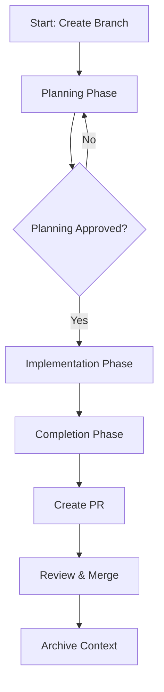

# Claude Code CLI Toolkit


> - _did-original-source_: `did:repo:ca85b5ea9bc63cc8229c073d8f6a3faae8062a77/blob/main/README.md`
> - _github-original-source_: `https://github.com/ChristopherA/Claude-Code-CLI-Toolkit/blob/main/README.md`
> - _purpose_: Provide overview of the Claude Code CLI Toolkit
> - _copyright_: ©2025 by @ChristopherA, licensed under the [BSD 2-Clause Plus Patent License](https://spdx.org/licenses/BSD-2-Clause-Patent.html)
> - _created_: 2025-03-19 by @ChristopherA <ChristopherA@LifeWithAlacrity.com>
> - _last-updated_: 2025-03-30 by @ChristopherA <ChristopherA@LifeWithAlacrity.com>
> - _version_: v0.1.03

## Project Overview

The Claude Code CLI Toolkit provides a structured environment for developing software projects with Claude AI assistance through the command line interface. This toolkit helps maintain consistent development practices across Claude-assisted projects.

## Who This Is For

This toolkit is designed primarily for:
- **Developers working with Claude Code CLI** who want a structured approach
- **Development teams sharing a repository** for collaborative AI-assisted projects
- **Project leads** implementing standardized Claude-assisted workflows
- **Anyone** interested in maintaining context across Claude sessions

It's particularly valuable for teams working on a common repository who need consistent processes.

## Purpose

This toolkit serves two main purposes:

1. **As a Starting Point**: Use these files as the foundation for new projects
2. **As a Reference**: Study this toolkit to understand Claude-assisted development

## Prerequisites

Before using this toolkit, you'll need:

1. **Claude CLI installed** - Install with npm:
   ```bash
   npm install -g @anthropic-ai/claude-code
   ```
   *Requires Node.js 18+. See the [complete Claude CLI documentation](https://docs.anthropic.com/en/docs/agents-and-tools/claude-code/overview) for detailed installation instructions.*

2. **Basic Git knowledge** - Understanding branches, commits, and pull requests
   *The toolkit uses a simplified git flow model based on feature branches and PRs to main*

## Quick Start

```bash
# Clone the repository
git clone https://github.com/ChristopherA/Claude-Code-CLI-Toolkit.git

# Enter the directory
cd Claude-Code-CLI-Toolkit

# Delete the .git folder to start fresh
rm -rf .git

# Run Claude to guide you through project setup
claude "load CLAUDE.md and help me setup this project"
```

## Getting Started

1. Clone this repository
2. Delete the `.git` folder to start fresh
3. Run Claude to guide you through project setup: `claude "load CLAUDE.md and help me setup this project"`
4. Follow the bootstrap.md instructions to customize for your project
5. Delete bootstrap.md when setup is complete

## Key Features

- **Structured Development Models**: Choose between Solo or Team development models
- **Planning Discipline**: Enforced planning phase approval before implementation begins
- **Context Management**: System for maintaining project context across sessions
- **Task Tracking**: Organized approach to tracking work and progress
- **Git Workflow**: Best practices for Git operations and commits
- **Documentation Structure**: Organized approach to project documentation

## Common Claude Commands

```bash
# Start Claude with project context
claude "load CLAUDE.md and help me continue project setup"

# For continuing work on a branch
claude "load CLAUDE.md, identify branch as feature/name, and continue working on task X"

# For switching to a new task
claude "load CLAUDE.md, check out branch feature/name, and help me implement feature X"

# For troubleshooting issues
claude "load CLAUDE.md and help me debug the error in component X"
```

## Development Models

The toolkit supports two development models:

### Solo Development Model
- For individual developers and personal projects
- Simplified workflows with less ceremony
- Direct commits to main allowed
- Reduced PR requirements
- Focus on rapid iteration

### Team Development Model
- For multi-developer teams and collaborative projects
- Structured branch protection
- Required code reviews and PRs
- Detailed context sharing between team members
- Enhanced security practices

### Process Workflow



⚠️ **Security Note**: The processes require human developer review and approval of all commits, PRs, and merges to main. Always carefully review AI-generated code and never blindly accept without reading. The repository uses Open Integrity Project commit signing to maintain integrity and attribution.

See [DEVELOPER_GUIDE.md](./DEVELOPER_GUIDE.md) for detailed information about these development models and approaches.

## Repository Structure

### Initial Structure
```
├── CLAUDE.md                  # Claude process frameworks and guidance
├── DEVELOPER_GUIDE.md         # Development models and project workflows
├── README.md                  # This file - project overview
├── WORK_STREAM_TASKS.md       # Task tracking and management
├── bootstrap.md               # Initial setup instructions (delete after setup)
├── contexts/                  # Branch-specific context files
│   ├── futures/               # Planned future contexts
│   └── archived.md            # Records of completed contexts
├── requirements/              # Project requirements and guides
│   └── guides/                # Detailed process documentation
└── scripts/                   # Utility scripts for Git operations
```

### Post-Setup Changes
After setup, expect these additional files and directories:
```
├── .git/                      # Git repository (created during setup)
├── contexts/                  
│   ├── feature-*-context.md   # Active context files for your branches
│   ├── fix-*-context.md       # Context files for bug fixes
│   └── docs-*-context.md      # Context files for documentation work
└── untracked/                 # For sensitive or local-only files (not committed)
    ├── credentials/           # API keys and tokens (NEVER commit these)
    └── local-config/          # Machine-specific configuration
```

💡 **Tip**: Any files with patterns in `.gitignore` will not be committed. Use the `untracked/` directory for sensitive information or large data files.

## Additional Resources

### Core Files
- [CLAUDE.md](./CLAUDE.md) - Process frameworks and Claude guidance
- [DEVELOPER_GUIDE.md](./DEVELOPER_GUIDE.md) - Development models and workflows
- [WORK_STREAM_TASKS.md](./WORK_STREAM_TASKS.md) - Task tracking and management

### Specialized Guides
- [Context Guide](./requirements/guides/context_guide.md) - Context file creation, management, and lifecycle
- [Git Workflow Guide](./requirements/guides/git_workflow_guide.md) - Git operations, branch management, and PR processes
- [Task Tracking Guide](./requirements/guides/task_tracking_guide.md) - Work organization, progress tracking, and status management
- [Error Recovery Guide](./requirements/guides/error_recovery_guide.md) - Troubleshooting common issues and state recovery

## Verifying Successful Setup

You'll know your setup is successful when:

1. Claude responds to process-aware commands like:
   ```
   claude "load CLAUDE.md and help me continue project setup"
   ```

2. The process framework properly detects your current branch and loads appropriate context

3. Planning phases require explicit approval before implementation begins

4. Context files track work progress across sessions

### Example Context File

Here's a snippet of what a typical context file looks like:

```markdown
# Feature Branch Context

## Current Status
- Current branch: feature/example-feature
- Started: 2025-03-15
- Last updated: 2025-03-30
- Progress: Planning phase
- Phase: Planning

## Scope Boundaries
- Primary Purpose: Implement example feature
- In Scope: 
  - Feature implementation
  - Unit tests
- Out of Scope:
  - Integration tests
  - Documentation updates

## Planning
### What We're Solving
[Problem description]

### Approval
- [ ] Planning approved - Ready to implement (YYYY-MM-DD)
```

✅ **Success Indicator**: When Claude references your context file information accurately during implementation

## Troubleshooting

**Common issues:**

- **Claude doesn't recognize process commands**: Ensure CLAUDE.md is properly loaded with the command format `claude "load CLAUDE.md and..."`.

- **Branch detection issues**: Make sure you're working in a git repository with at least one commit.

- **Context file errors**: Check that your context files follow the template and are in the correct location.

- **Implementation blocked**: Planning phase requires approval with the exact phrase "I APPROVE THE PLANNING PHASE".

## Real-World Examples

This toolkit is currently being tested in:
- [z_Utils](https://github.com/ChristopherA/z_Utils) - A collection of Zsh utility functions
- Future implementation planned for the [Open Integrity Project](https://github.com/OpenIntegrityProject/core)

## Contributing

We welcome contributions to improve the toolkit:

1. Fork the repository
2. Create a feature branch
3. Make your changes
4. Submit a pull request

If your work involves a context file, append it to the PR description rather than adding it to the contexts folder.

For questions or suggestions, open an issue on GitHub.

## Version History

### v0.1.03 (2025-03-30)
- Enhanced documentation with Developer Guide (renamed from PROJECT_GUIDE.md)
- Added natural language pattern detection
- Improved consistency across documentation files
- Updated references to DEVELOPER_GUIDE.md

### v0.1.02 (2025-03-25)
- Integrated Claude-optimized process frameworks
- Improved repository workflow processes
- Enhanced context management capabilities

### v0.1.01 (2025-03-22)
- Improved initial project setup process
- Added metadata headers to core files
- Improved Git workflow guides

### v0.1.00 (2025-03-19)
- Initial release with core toolkit structure and files
- Established basic documentation framework
- Set up initial process structure

## Updating Toolkit Files

After customizing this toolkit for your project, you can't use Git pull to get updates from the original repository. Instead, follow these steps to manually update specific files:

1. **Check for Updates**: Look at the `_github-original-source_` URL in the file's metadata header
2. **Compare Versions**: Visit the URL to compare with your customized version
3. **Download Updates**: If updates are valuable, download the latest version
4. **Merge Changes**: Manually incorporate changes while preserving your customizations

### Which Files to Update

Best candidates for updates:
- `requirements/guides/*.md` files - workflow guides that may be improved
- `DEVELOPER_GUIDE.md` - development model documentation

Files to avoid updating:
- `CLAUDE.md` - Contains your project-specific context
- Any files you've heavily customized for your specific project
- Context files in the `contexts/` directory